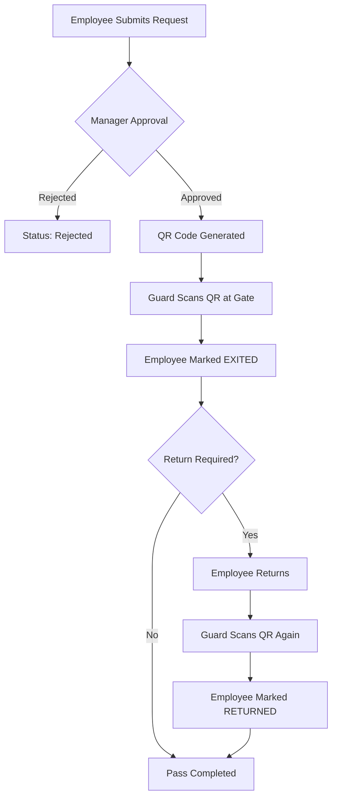

# 🔐 Basilur Exit Pass Management System

A professional, digital solution for managing employee exit passes. This system replaces manual paper logs with a streamlined QR-based workflow, ensuring security, transparency, and real-time tracking of all employee movements.

---

## 🌟 Key Features

- **Digital QR Passes**: Automatically generated 6-digit unique QR codes for approved exit requests.
- **Role-Based Access**: Specialized views for Employees, Approvers, Guards, HR, and Admins.
- **Real-time Movement Log**: Instant tracking of employee exit and return times.
- **Security First**: Password-protected access for HR and Admin roles.
- **Automatic Expiry**: Safety feature that expires unused passes after the planned return time.
- **Return Tracking**: Option to specify if a return is required, allowing for one-way or round-trip passes.
- **Mobile Ready**: Fully responsive design for use on smartphones, tablets, and desktops.
- **Multi-Channel Notifications**: Automated SMS and Email updates for pass status changes.

---

## 👥 Roles & Permissions

The system is built on a robust role-based access control (RBAC) model:

### 👤 Employee
*Primary User who initiates the exit workflow.*
- ✅ **CAN**: Submit new exit pass requests.
- ✅ **CAN**: View personal pass history with pagination.
- ✅ **CAN**: Access unique QR codes for approved passes.
- ✅ **CAN**: Cancel pending requests or send reminders to approvers.
- ✅ **CAN**: Update personal profile details (Phone/Email).

### 👔 Approver (Manager / Dept. Head)
*Decision-maker responsible for reviewing requests.*
- ✅ **CAN**: View real-time list of all PENDING requests.
- ✅ **CAN**: Approve or Reject requests via portal or direct SMS link.
- ✅ **CAN**: View the status of all passes across the organization.

### 🛡️ Guard (Security Personnel)
*Enforcer of gate security and movement logging.*
- ✅ **CAN**: Scan QR codes or manually enter Pass IDs.
- ✅ **CAN**: Verify if a pass is valid, approved, and not expired.
- ✅ **CAN**: Mark an employee as **EXITED** or **RETURNED**.
- ✅ **CAN**: View the **Guard Log** (filtered for current day's active passes).

### 🏢 HR & Admin
*System administrators.*
- ✅ **CAN**: Perform all duties of Approvers and Guards.
- ✅ **CAN**: **Add, Edit, and Delete** user profiles across multiple sheets (Factory/Office).
- ✅ **CAN**: Manage employee roles and set/reset administrative passwords.
- 🔐 **SECURITY**: Requires a unique password for entry.

---

## ⚙️ Core Application Logic

The system is governed by several automated business rules to ensure efficiency and data integrity:

### 1. Pass Creation Rules
- **Single Active Pass Constraint**: An employee cannot create a new request if they already have an "active" pass (Status: `PENDING`, `APPROVED`, or `EXITED`).
- **Auto-Rejection of Stale Passes**: When a user attempts to create a new request, the system automatically checks for old `PENDING` passes. Any pending pass from a previous day or more than 2 hours old today is auto-rejected to keep the queue clean.
- **1.5 Hour Return Policy**: By default, the system calculates an "Expected Return Time" exactly **1.5 hours (90 minutes)** from the requested exit time. This serves as the threshold for overdue monitoring.
- **User ID Normalization**: The system automatically strips leading zeros (e.g., `002` → `2`) and handles case-insensitivity to ensure consistent tracking across different entry formats.

### 2. Guard & Movement Logic
- **Automated Expiry Check**: When a Guard scans a pass, the system performs a real-time validity check. If the pass is `APPROVED` but the current time has exceeded the "Expected Return Time" (or it's from a previous day), the status is auto-updated to `EXPIRED`.
- **Duration Tracking & Color Coding**: For employees who have exited, the Guard view tracks the duration of their absence. If the duration exceeds **90 minutes**, the system highlights the entry as **LATE** (Red) to alert security.
- **Long-Press Override**: Security guards can perform a "Long Press" (800ms) on any pass entry to trigger a manual status override, allowing them to correct accidental exit/return markings.
- **Smart Filtering & Sorting**: The Guard list dynamically de-duplicates and sorts entries: **Upcoming Exits** (Top) → **Expected Returns** (Middle) → **Today's History** (Bottom).
- **Movement Hierarchy**: Passes must follow a strict logical flow: `NOT_EXITED` → `EXITED` → `RETURNED`. Once `RETURNED`, the pass lifecycle is closed.

### 3. UI/UX Features
- **Real-time Clock**: All administrative and guard views feature a synchronized real-time clock and date display in the navigation bar for accurate timestamp verification.
- **Interactive Reminders**: Employees can send a "Remind Approver" alert for passes pending for more than 30 minutes, keeping the workflow moving.
- **Paginated Data**: Large logs (History/Admin) are paginated to ensure optimal performance on mobile devices with limited bandwidth.

### 4. Notification Logic
- **SMS Gateway (Gammu)**: A specialized Python bridge polls the database and sends SMS via a GSM modem.
    - **Approvers** receive a direct link to approve/reject immediately upon request.
    - **Employees** receive an SMS with their unique Pass ID and QR link once approved.
- **Email Automation**: Professional email notifications are sent for every status change, ensuring a traceable audit trail for HR and Management.

---

## 🔄 System Workflow

---

## 🏛 Architecture

| Layer | Technology | Role |
| :--- | :--- | :--- |
| **Frontend** | HTML5, Vanilla CSS, JS | UI and Client-side logic (GitHub Pages) |
| **Backend** | Google Apps Script | RESTful API and Business Logic |
| **Database** | Google Sheets | Cloud-based data storage and persistence |
| **QR Engine** | qrcode.js | Client-side QR generation |
| **Scanner** | jsQR | Browser-based QR scanning |
| **SMS Gateway** | Python, Gammu | Local service polling DB and sending SMS via GSM Modem |

---

## 🛠 Setup & Deployment

1. **Database**: Create a Google Sheet and run `setupDatabase()` from the provided `Code.gs`.
2. **Backend**: Deploy `Code.gs` as a Web App (Execute as: Me, Access: Anyone).
3. **Frontend**: Update `js/config.js` with your Web App URL and host on GitHub Pages.
4. **SMS Gateway**: (Optional) Run `sms_gateway.py` on a PC with a connected GSM modem.

---

## 📊 Sheet Structure Reference

### USERS Sheet (FACTORY_USERS / OFFICE_USERS)
- `user_id`: Employee Number (Normalized)
- `name`: Full Name
- `role`: employee / approver / guard / hr / admin
- `password`: Admin/HR login password
- `phone`: Mobile number for SMS

### EXIT_PASSES Sheet
- `pass_id`: Unique 6-digit ID
- `approval_status`: PENDING / APPROVED / REJECTED / CANCELLED
- `movement_status`: NOT_EXITED / EXITED / RETURNED / EXPIRED
- `exit_to`: Calculated Expected Return Time (1.5h default)

---

## 📄 License
Internal organizational tool for **Basilur**. Licensed under the MIT License.
