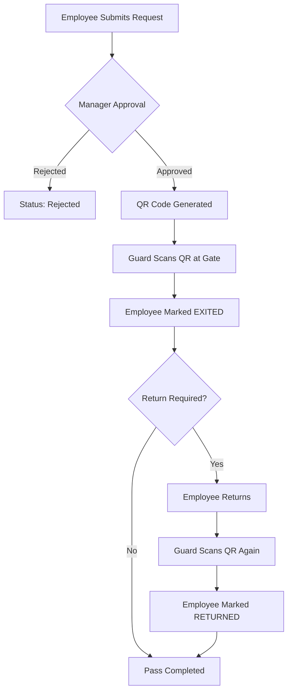

# 🔐 Basilur Exit Pass Management System

A professional, digital solution for managing employee exit passes. This system replaces manual paper logs with a streamlined QR-based workflow, ensuring security, transparency, and real-time tracking of all employee movements.

---

## 🌟 Key Features

- **Digital QR Passes**: Automatically generated 6-digit unique QR codes for approved exit requests.
- **Role-Based Access**: Specialized views for Employees, Approvers, Guards, HR, and Admins.
- **Real-time Movement Log**: Instant tracking of employee exit and return times.
- **Security First**: Password-protected access for HR and Admin roles.
- **Automatic Expiry**: Safety feature that expires unused passes after the planned return time.
- **Return Tracking**: Option to specify if a return is required, allowing for one-way or round-trip passes.
- **Mobile Ready**: Fully responsive design for use on smartphones, tablets, and desktops.
- **SMS Notifications**: Automated SMS updates to employees for exit pass statuses via Gammu SMS Gateway.

---

## 👥 Roles & Permissions

The system is built on a robust role-based access control (RBAC) model. Below is a breakdown of what each role can and cannot do:

### 👤 Employee
*Primary User who initiates the exit workflow.*
- ✅ **CAN**: Submit new exit pass requests (specifying reason, time, and return requirement).
- ✅ **CAN**: View their personal pass history and current status.
- ✅ **CAN**: Access their unique QR code once a pass is approved.
- ❌ **CANNOT**: Approve or reject any passes.
- ❌ **CANNOT**: Mark themselves as exited or returned.
- ❌ **CANNOT**: View other employees' requests or manage users.

### 👔 Approver (Manager / Department Head)
*Decision-maker responsible for reviewing requests.*
- ✅ **CAN**: View a real-time list of all PENDING requests.
- ✅ **CAN**: Approve or Reject requests with their name logged as the approver.
- ✅ **CAN**: View the status of all passes across the organization.
- ❌ **CANNOT**: Mark movements (exit/return) at the gate.
- ❌ **CANNOT**: Modify user profiles or system settings.

### 🛡️ Guard (Security Personnel)
*Enforcer of gate security and movement logging.*
- ✅ **CAN**: Scan QR codes using any device with a camera.
- ✅ **CAN**: Verify if a pass is valid, approved, and not expired.
- ✅ **CAN**: Mark an employee as **EXITED** or **RETURNED**.
- ✅ **CAN**: View the **Guard Log** (recent movement history).
- ✅ **CAN**: Manually enter Pass IDs if the camera is unavailable.
- ❌ **CANNOT**: Approve or Reject pending pass requests.
- ❌ **CANNOT**: View sensitive employee data unrelated to the exit.

### 🏢 HR (Human Resources)
*User and compliance administrator.*
- ✅ **CAN**: Do everything an **Approver** can.
- ✅ **CAN**: **Add, Edit, and Delete** user profiles in the system.
- ✅ **CAN**: Manage employee roles and department assignments.
- ✅ **CAN**: Set and reset passwords for administrative users.
- 🔐 **SECURITY**: Requires a password to log in.

### ⚙️ Admin (System Administrator)
*Full system controller.*
- ✅ **CAN**: Access all features and views without restrictions.
- ✅ **CAN**: Perform HR duties, Approver duties, and Guard duties.
- ✅ **CAN**: View system-wide statistics and logs.
- 🔐 **SECURITY**: Requires a password to log in.

---

## 🔄 System Workflow

---

## 🏛 Architecture

| Layer | Technology | Role |
| :--- | :--- | :--- |
| **Frontend** | HTML5, Vanilla CSS, JS | UI and Client-side logic (GitHub Pages) |
| **Backend** | Google Apps Script | RESTful API and Business Logic |
| **Database** | Google Sheets | Secure data storage and persistence |
| **QR Engine** | qrcode.js | Client-side QR generation |
| **Scanner** | jsQR | Browser-based QR scanning |
| **SMS Gateway** | Python, Gammu | Local service polling Google Sheets and sending SMS via Huawei E3372 GSM modem |

---

## 🛠 Setup & Deployment

### 1. Database Setup
1. Create a new Google Spreadsheet named `BasilurExitPassDB`.
2. Open **Extensions > Apps Script**.
3. Paste the contents of `Code.gs` into the script editor.
4. Run the `setupDatabase()` function from the editor. This will create the `USERS` and `EXIT_PASSES` sheets with correct headers.

### 2. API Deployment
1. In the Apps Script editor, click **Deploy > New Deployment**.
2. Select **Web App**.
3. Set **Execute as: Me** and **Who has access: Anyone**.
4. Copy the generated **Web App URL**.

### 3. Frontend Configuration
1. Open `js/config.js` in the project folder.
2. Replace the `API_URL` value with your Web App URL.
3. Update `ORG_NAME` and other branding details as needed.

### 4. SMS Gateway Setup (Optional)
1. Install **Gammu** and Python on a local machine connected to a Huawei E3372 GSM modem.
2. Install Python dependencies: `pip install -r "SMS Gateway/requirements.txt"` (requires `requests`).
3. Update `API_URL` in `SMS Gateway/sms_gateway.py` with your Apps Script Web App URL.
4. Run the gateway: `python "SMS Gateway/sms_gateway.py"`. This script will poll the `SMS_QUEUE` sheet and send messages.

---

## 📊 Sheet Structure Reference

### USERS Sheet
| Column | Field | Description |
| :--- | :--- | :--- |
| A | user_id | Employee Number (Unique) |
| B | name | Full Name |
| C | department | Department |
| D | role | employee / approver / guard / hr / admin |
| E | email | Email Address |
| F | password | Login password (for HR/Admin only) |

### EXIT_PASSES Sheet
| Column | Field | Description |
| :--- | :--- | :--- |
| A | pass_id | Unique 6-digit ID (e.g., 100001) |
| G | approval_status | PENDING / APPROVED / REJECTED |
| J | movement_status | NOT_EXITED / EXITED / RETURNED / EXPIRED |
| N | return_required | Yes / No |

---

## 🛠 Troubleshooting

- **"User not found"**: Ensure the Employee Number matches exactly what is in the USERS sheet.
- **"CORS Error"**: Ensure the Apps Script is deployed as "Anyone" and you are using the latest deployment URL.
- **Scan Issues**: Check camera permissions in your mobile browser. Lighting should be sufficient for the QR code to be clear.
- **Auto-Expiry**: If a pass expires too soon, check the `exit_to` time provided during the request.

---

## 📄 License

This project is licensed under the MIT License. Built for internal organizational use at **Basilur**.
