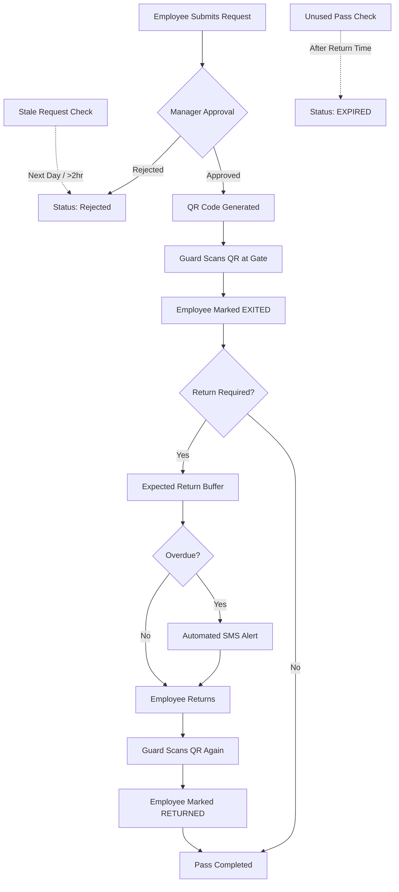

# 🔐 Basilur Exit Pass Management System

A professional, digital solution for managing employee exit passes. This system replaces manual paper logs with a streamlined QR-based workflow, ensuring security, transparency, and real-time tracking of all employee movements.

---

## 🌟 Key Features

- **Digital QR Passes**: Automatically generated unique 6-digit numeric IDs and QR codes for all approved exit requests.
- **Role-Based Access**: Granular control for Employees, Approvers, Security Guards, HR, and Admins.
- **HR Statistics Dashboard**: Professional analytics suite with weekly trends, hourly distribution, reason analysis, and top exiter tracking.
- **Automated Overdue Alerts**: Real-time monitoring with automated SMS alerts sent to employees who overstay their return window.
- **Flexible Return Monitoring**: Approvers can specify expected return buffers (1h, 2h, 3hr, or none) during the approval process.
- **Movement Hierarchy**: Strict logical flow (`NOT_EXITED` → `EXITED` → `RETURNED`) with guard-based timestamping and force-override capabilities.
- **Security Guard Log**: Optimized list view featuring a live 24h clock, auto-refresh, and color-coded status indicators (Amber for upcoming, Red for late).
- **Multi-Channel Notifications**: Real-time SMS (via Python/Gammu bridge) and HTML-email notifications for all stakeholders.
- **Mobile-First Design**: Fully responsive UI designed for rugged gate-side tablet use and mobile employee access.

---

## 👥 Roles & Permissions

The system is built on a robust role-based access control (RBAC) model:

### 👤 Employee
*Primary User who initiates the exit workflow.*
- ✅ **CAN**: Submit new exit requests and update contact details (Phone/Email).
- ✅ **CAN**: View personal pass history with optimized pagination (5 records per page).
- ✅ **CAN**: Access dynamic QR codes and send reminders to HR for pending requests.
- ✅ **CAN**: Cancel their own pending requests if no longer needed.

### 👔 Approver (Manager / Dept. Head)
*Decision-maker responsible for reviewing requests.*
- ✅ **CAN**: Filter and approve requests with specific **Expected Return Durations**.
- ✅ **CAN**: Receive direct SMS/Email links to process passes instantly from mobile.
- ✅ **CAN**: Monitor department-wide movements in real-time.

### 🛡️ Guard (Security Personnel)
*Enforcer of gate security and movement logging.*
- ✅ **CAN**: Use the QR Scanner or Manual ID Entry for high-speed gate processing.
- ✅ **CAN**: Access a dedicated **Guard List** that auto-refreshes every 5 mins.
- ✅ **CAN**: Track active durations with visual "Late" (Red/Pulse) indicators.
- ✅ **CAN**: **Force Override**: Long-press any entry (800ms) to manually correct movement status.

### 🏢 HR & Admin
*System administrators and analysts.*
- ✅ **CAN**: Access the **Statistics Dashboard** for behavioral analysis and trend tracking.
- ✅ **CAN**: **Export Data**: Download the entire pass history as a CSV for reporting.
- ✅ **CAN**: Manage the User Directory (FACTORY_USERS / OFFICE_USERS).
- 🔐 **SECURITY**: Advanced dashboard features require a distinct administrative password.

---

## ⚙️ Core Application Logic

The system is governed by several automated business rules to ensure efficiency and data integrity:

### 1. Pass Creation Rules
- **Anti-Duplication Constraint**: Employees cannot create new requests while they have an active pass (`PENDING`, `APPROVED`, or `EXITED`).
- **Auto-Cleanup**: The system auto-rejects `PENDING` requests that are from previous days or > 2 hours old to prevent queue clutter.
- **Normalization Engine**: Automatically formats Employee IDs (e.g., `002` → `2`) to prevent duplicate records and ensure search accuracy.

### 2. Guard & Movement Logic
- **Precision Timing**: Movement is tracked from the *actual* exit time, not the requested time. The return window updates dynamically upon exit scan.
- **Smart Expiry**: Passes auto-expire if not used by the expected return time.
- **Late Indicators**: If "Return Required" is Yes, the system pulses **Red** once the 90-minute (or custom) threshold is exceeded.
- **Force Revert**: Security can revert statuses (e.g., `RETURNED` → `EXITED`) via the long-press modal to fix human errors during busy hours.
- **Auto-Refresh**: The Guard List refreshes every 5 minutes to ensure new approvals appear without manual interaction.

### 3. HR & Analytics
- **Live Statistics**: real-time breakdown of Pending, Approved, Rejected, and "Currently Out" counts.
- **Detailed Trends**: Last 7/30/90 day analytics showing:
    - **Weekly Exit Trends** (Growth/Decline)
    - **Reason Distribution** (Doughnut chart)
    - **Departmental Comparison** (Bar chart)
    - **Hourly Peak Analysis** (Histogram)
- **Frequent Exiters**: Dynamic table showing employees with the highest exit frequency and total time away.
- **CSV Data Hub**: Single-click export of the entire database for external audit activities.

### 4. Notification Logic
- **SMS Gateway (Gammu)**: A specialized Python bridge polls the database and sends SMS via a GSM modem.
    - **Approvers** receive a direct link to approve/reject immediately upon request.
    - **Employees** receive an SMS with their unique Pass ID and QR link once approved.
- **Email Automation**: Professional email notifications are sent for every status change, ensuring a traceable audit trail for HR and Management.

---

## 🔄 System Workflow

---

## 🏛 Architecture

| Layer | Technology | Role |
| :--- | :--- | :--- |
| **Frontend** | HTML5, Vanilla CSS, JS | UI and Client-side logic (GitHub Pages) |
| **Backend** | Google Apps Script | RESTful API and Business Logic |
| **Database** | Google Sheets | Cloud-based data storage and persistence |
| **QR Engine** | qrcode.js | Client-side QR generation |
| **Scanner** | jsQR | Browser-based QR scanning |
| **SMS Gateway** | Python, Gammu | Local service polling DB and sending SMS via GSM Modem |

---

## 🛠 Setup & Deployment

1. **Database**: Create a Google Sheet and run `setupDatabase()` from the provided `Code.gs`.
2. **Backend**: Deploy `Code.gs` as a Web App (Execute as: Me, Access: Anyone).
3. **Frontend**: Update `js/config.js` with your Web App URL and host on GitHub Pages.
4. **SMS Gateway**: (Optional) Run `sms_gateway.py` on a PC with a connected GSM modem.

---

## 📊 Sheet Structure Reference

### USERS Sheet (FACTORY_USERS / OFFICE_USERS)
- `user_id`: Employee Number (Normalized)
- `name`: Full Name
- `role`: employee / approver / guard / hr / admin
- `password`: Admin/HR login password
- `phone`: Mobile number for SMS

### EXIT_PASSES Sheet
- `pass_id`: Unique 6-digit ID
- `approval_status`: PENDING / APPROVED / REJECTED / CANCELLED
- `movement_status`: NOT_EXITED / EXITED / RETURNED / EXPIRED
- `exit_to`: Calculated Expected Return Time (1.5h default)

---

## 📄 License
Internal organizational tool for **Basilur**. Licensed under the MIT License.
